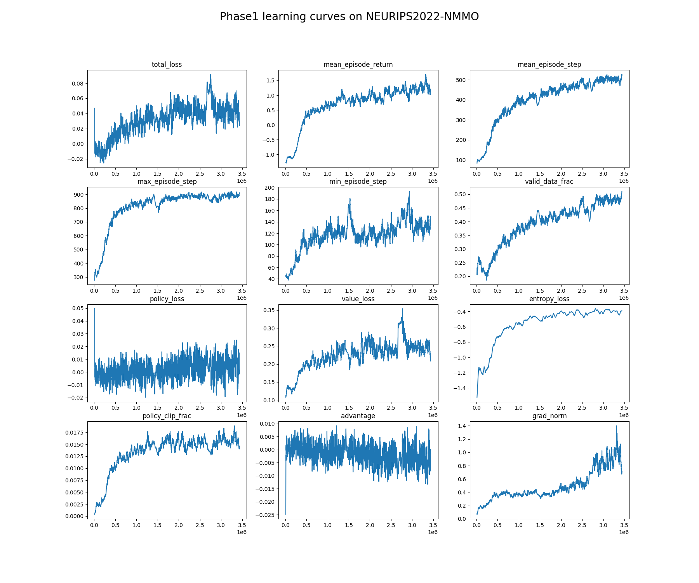
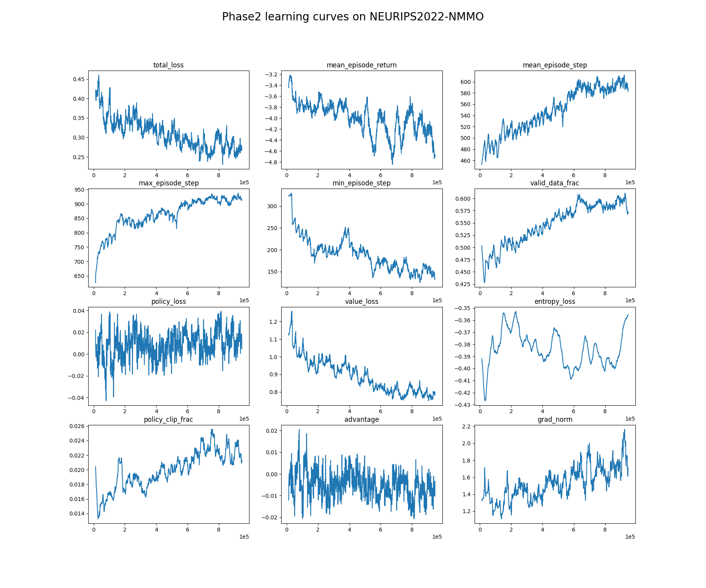

# Neurips2022-NMMO BASELINES
## Install
```bash
pip install -r requirements.txt
```
The baseline is based on [monobeast](https://github.com/facebookresearch/). For successful submission, you must copy all files under the directory `baseline/` to [`neurips2022-nmmo-starter-kit/my-submission/`](https://gitlab.aicrowd.com/neural-mmo/neurips2022-nmmo-starter-kit/-/tree/main/my-submission).


## Train and evaluation
```bash
cd baseline/

# train
bash train.sh

# plot
python plot.py

# local evaluation
python eval.py
```

## Learning curve






## Implementation Details

### **Overview: RL + Script**

For simplicity, we only use RL to learn `move & attack` strategy and use a script for `use & buy & sell` strategy. The script is based on the built-in scripted agent `Melee`.

```python
class MyMelee(Melee):
    name = 'MyMelee'

    def __call__(self, obs):
        super(Combat, self).__call__(obs)
        self.use()
        self.exchange()
        assert nmmo.action.Move not in self.actions
        assert nmmo.action.Attack not in self.actions
        return self.actions


class MyMeleeTeam(ScriptedTeam):
    agent_klass = [MyMelee]
```

### **Feature and network**
The feature consists of local map and entity. For details refer to [`feature_parser.py`](./baseline/neural_mmo/feature_parser.py)：

The network is implemented as a simple CNN + MLP. See [networks.py](./baseline/neural_mmo/networks.py) for details.

### **Reward**
We provide a simple design for reward setting, shown as below. See
[`reward_parser.py`](./baseline/neural_mmo/reward_parser.py) for implementation details.

> R_t = Alive_reward + Defeat_reward + Profession_reward + Equipment_reward - DamageTaken_penalty - Starvation_penalty - Death_penalty


### **Hints for getting stronger agents...**
- Optimzize reward design.
- Tune hyper-parameters.
- Optimize feature design and network architecture.
- Use team reward instead of individual reward.
- Advanced options: distributed RL, league training, PBT, ... 


## FAQ

##### 1. How can I speed up training?
Ans: You can increase `num_actors`, but restrict to the maximum available cpu cores you have. 

For example, if you have a machine with 16 cores,  you can set `num_actors` to 15 for the fastest training speed. However, this will consume most of your compute resource and make your machine very slow. We recommend setting `num_actors` to 12 at this circumstance.

##### 2. How do I handle "unable to open shared memory object" error when run monobeast baseline?
Ans: This error is usually encountered by the number of open file descriptors exceeding your system's limits. 

You can raise them or try smaller `num_actors, batch_size, unroll_length`. Please refer to [pytorch multiprocessing document](https://pytorch.org/docs/stable/multiprocessing.html#sharing-strategies) for more information.
